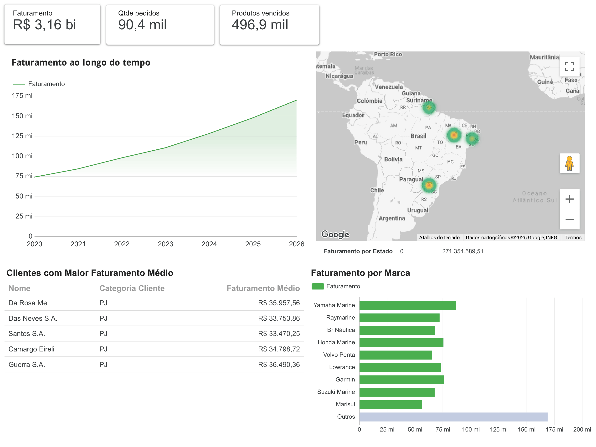

# LH Nauticals Pipeline e dados, utilizando arquitetura Medalhão

Pipeline de dados end-to-end desenvolvido com base nos conceitos da **Arquitetura Medallion (Raw -> Bronze -> Silver -> Gold)**, focado em engenharia de dados, tratamento de nulos/tipos, geração dinâmica de DDL e carga automatizada para banco relacional e Business Intelligence.

---



---

## 🛠️ Tecnologias Utilizadas

* **Python 3.10+** (Pandas, SQLAlchemy, Python-dotenv)
* **PostgreSQL** (Banco de dados relacional)
* **Docker & Docker Compose** (Containerização do ambiente)
* **Looker Studio** (Visualização e criação de Dashboards)

---

## 📂 Estrutura do Projeto

```text
lh_nauticals/
│
├── csv_to_ddl/             # Módulo de automação DDL a partir de arquivos CSV
│   ├── ddl.py              # Script gerador de esquema SQL dinâmico
│   └── schema.sql          # Schema gerado/utilizado pelo banco
│
├── dados/                  # Armazenamento local dividido por camadas
│   ├── raw/                # Dados brutos originais
│   ├── bronze/             # Seleção inicial e filtragem de colunas
│   ├── silver/             # Dados tratados, normalizados e limpos
│   └── gold/               # Dados consolidados para consumo final
│
├── src/                    # Código-fonte principal do pipeline
│   ├── config.py           # Configurações globais e caminhos
│   ├── script_bronze.py    # Ingestão e seleção da camada Bronze
│   ├── script_silver.py    # Limpeza, normalização e tipagem (Silver)
│   ├── script_gold.py      # Unificação e consolidação (Gold)
│   └── script_db.py        # Integração com banco de dados e carga
│
├── .env.example            # Exemplo de variáveis de ambiente
├── docker-compose.yml      # Orquestração de containers (PostgreSQL)
├── main.py                 # Orquestrador geral do pipeline
└── requirements.txt        # Dependências do projeto.
```

## 🔄 Fluxo de Processamento (Arquitetura Medallion)

1. Raw (dados/raw/): Armazena os dados brutos obtidos da fonte original sem alterações.
2. Bronze (script_bronze.py): Realiza a seleção inicial das tabelas e colunas de interesse para o escopo do negócio.
3. Silver (script_silver.py): Executa a limpeza profunda, normalização de nomes, tratamento de valores inconsistentes e padronização de tipos.
4. Gold (script_gold.py): Unifica as tabelas processadas, gerando a camada final pronta para consumo analítico.
5. Carga e DDL (csv_to_ddl/ e script_db.py): Lê os arquivos estruturados, infere os tipos de dados via Pandas, gera dinamicamente os scripts DDL (schema.sql) e persiste tudo em um banco de dados PostgreSQL.

## ⚙️ Como Executar o Projeto

1. Pré-requisitos
Python instalado na máquina.
Docker e Docker Compose configurados (opcional, caso queira subir o banco via container).

2. Clonar o repositório e instalar dependências
git clone [https://github.com/Gab625/lh_nauticals.git](https://github.com/Gab625/lh_nauticals.git)
cd lh_nauticals
pip install -r requirements.txt

3. Configurar as Variáveis de Ambiente
O projeto utiliza variáveis de ambiente para gerenciar a conexão com o banco de dados. Na raiz do projeto, crie um arquivo chamado **`.env`*espelhando a seguinte estrutura:

```env
DB_USER=seu_usuario
DB_PASSWORD=sua_senha
DB_HOST=localhost
DB_PORT=5432
DB_NAME=lh_nauticals
```

4. Subir o Banco de Dados (Opcional via Docker)
docker-compose up -d

5. Executar o Pipeline
python main.py
